# User Journey: Caching Tool Results

## Scenario

You want to cache results for read-only tools to reduce latency and cost. Cache
entries expire after 30 seconds, and you want deterministic keys.

## Step 1: Initialize cache

```go
cache := toolcache.NewMemoryCache(
    toolcache.WithDefaultTTL(30*time.Second),
)
keyer := toolcache.NewKeyer()
```

## Step 2: Wrap execution

```go
mw := toolcache.NewMiddleware(cache, keyer)
wrapped := mw.Wrap(toolrunExecutor)
_ = wrapped
```

## Step 3: Execute tool

- First call populates cache
- Subsequent calls within TTL return cached result

## Flow Diagram

```mermaid
%%{init: {'theme': 'base', 'themeVariables': {'primaryColor': '#38a169'}}}%%
flowchart TD
    subgraph input["Input"]
        A["📥 Tool Call<br/><small>toolID + args</small>"]
    end

    subgraph middleware["Cache Middleware"]
        Skip{"🔍 Check<br/>Skip Rules?"}
        SkipNote["Skip tags:<br/><small>write, danger, unsafe,<br/>mutation, delete</small>"]

        Key["🔑 Generate Key<br/><small>toolcache:{id}:{SHA256(args)}</small>"]
        Lookup["💾 Cache.Get(key)"]
        Hit{"Cache<br/>Hit?"}
    end

    subgraph execution["Execution"]
        Exec["▶️ Execute Tool"]
    end

    subgraph store["Cache Store"]
        Store["💾 Cache.Set(key, result)"]
        TTL["⏱️ TTL: 30s default"]
    end

    subgraph output["Output"]
        Return["📤 Return Result"]
    end

    A --> Skip
    SkipNote -.-> Skip
    Skip -->|"matches skip tag"| Exec
    Skip -->|"cacheable"| Key --> Lookup --> Hit
    Hit -->|"✅ yes"| Return
    Hit -->|"❌ no"| Exec
    Exec --> Store --> TTL --> Return

    style input fill:#3182ce,stroke:#2c5282
    style middleware fill:#38a169,stroke:#276749,stroke-width:2px
    style execution fill:#d69e2e,stroke:#b7791f
    style store fill:#6b46c1,stroke:#553c9a
    style output fill:#3182ce,stroke:#2c5282
```



## Cache Key Generation


